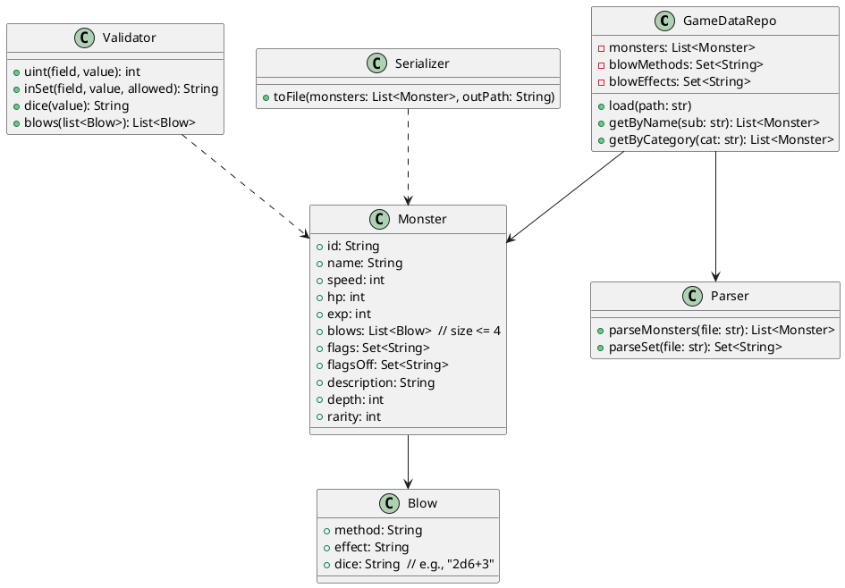
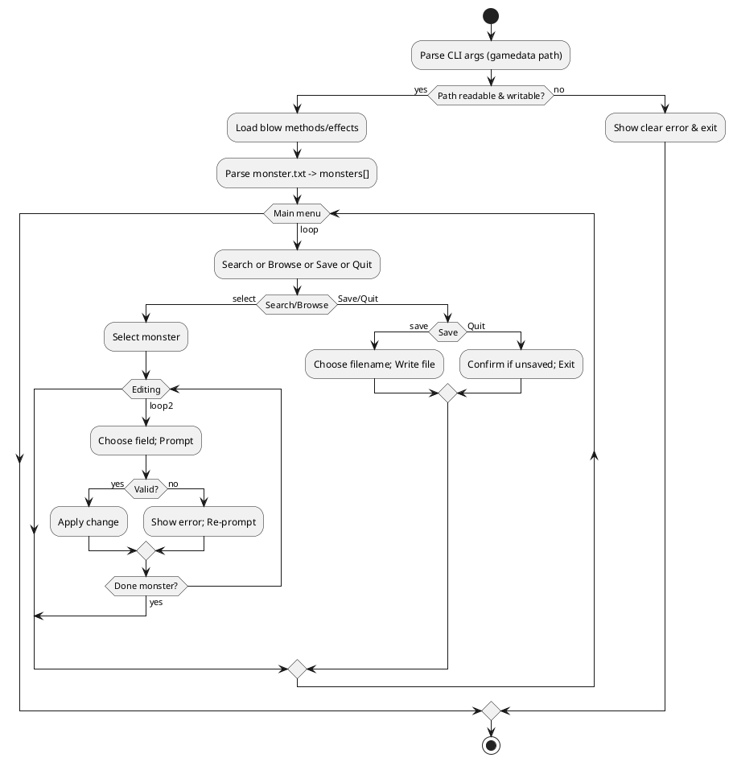

# Monster File Editor (MFE) – Development Plan (A05)

## Team Roster
- Yash Takte — ytakte@iu.edu
- Andrew Perez — perezand@iu.edu
- Nolan Uhl — ntuhl@iu.edu
- Lokesh Reddy Elluri — lelluri@iu.edu
- Shahetha Shanmugam — shahshan@iu.edu

---

## 1. Design Document

### 1.1 Use-Case Overview
We are building a small command‑line tool that edits monsters used by the Angband game. The tool reads the game's data files (like `monster.txt`) from a folder called **gamedata**. The user picks a monster, changes some fields, and saves a new `monster.txt`‑style file.

#### 1.1.1 Information needed by User
- The full path to the **gamedata** folder and **write** permission to it.
- The monster name (or part of the name) they want to edit, or which category it belongs to.
- That some fields only accept certain values:
  - **Blow methods** must come from `blow_methods.txt` (e.g., HIT, BITE, CLAW).
  - **Blow effects** must come from `blow_effects.txt` (e.g., HURT, FIRE, COLD).
  - **Flags / Flags-off** are accepted as free-form pipe-separated text (e.g., EVIL | ORC).
- A new file name to save changes to (e.g., `monster.mfe.txt`).

### 1.2 List of screens or user operations
| ID | Screen / Operation | What it does | Main actions |
|----|--------------------|--------------|--------------|
| S1 | Startup / Load     | Start program and load game data | `python -m mfe.cli "<path>\gamedata"` → show how many monsters/methods/effects were loaded (or a clear error) |
| S2 | Main Menu          | Central menu | 1) Search 2) Browse by category 3) Save-As 4) Quit |
| S3 | Search             | Find a monster by text | Enter a name part (e.g., "orc"); see a short, paged list; pick a number |
| S4 | Browse             | Pick by category/base type | Show categories → list monsters in that category → pick one |
| S5 | Monster Details    | Show current fields | Show: name, speed, hit-points, experience, up to 4 blows (method/effect/dice), flags, flags-off, description lines, plus two extras (depth, rarity) |
| S6 | Edit Field         | Change one field safely | Prompt → validate (uint / allowed set / dice / max 4 blows) → apply or re‑prompt |
| S7 | Save-As            | Write a new file | Suggest `monster.mfe.txt` or let user type another name; confirm write |
| S8 | Quit               | Exit safely | Warn if there are unsaved changes |

### 1.3 Class Diagram


**PlantUML Source**


### 1.4 Activity Flow Diagram


**PlantUML Source**


### 1.5 Expected Outcomes - what does the program change
- Creates a **new** monster data file (Angband‑compatible) that reflects the user's edits.
- Ensures values are valid for the game (correct sets, numbers ≥ 0, dice format, max 4 blows).
- Does **not** touch the original files unless the user later replaces them manually.

### 1.6 Milestones - major points of delivery in project
| Milestone ID | Description | Target Date |
| ------------ | ----------- | ----------- |
| M1 | A05: Design docs + test plan + tasks + estimates | Oct 10, 2025 |
| M2 | Parsers & Validators with unit tests | Oct 16, 2025 |
| M3 | Serializer round‑trip passing | Oct 20, 2025 |
| M4 | CLI Search/Browse flows | Oct 24, 2025 |
| M5 | Full Edit & Save‑As; integration tests | Oct 27, 2025 |
| M6 | A06 Submission (working program + man page + README + tests) | Oct 29, 2025 |

---

## 2. Test Plan

### 2.1 Description of testing - unit, integration, performance
- **Unit tests**: small pieces — parser, validator (uint, allowed sets, dice, max blows), serializer.
- **Integration tests**: full flow — load → edit → save → reload → values persist.
- **CLI tests**: simulate typing — search, browse, invalid input, save‑as name conflicts.
- **Performance (light)**: loading full `monster.txt` should be quick enough for interactive use.

### 2.2 Test Cases
| Test Case ID | Description | Preconditions | Steps | Expected Result | Actual Result | Tested By |
| ------------ | ----------- | ------------- | ----- | --------------- | ------------- | --------- |
| P01 | Parse minimal fixtures | Fixture gamedata exists | Run load | 2 monsters parsed (or "fixtures parse correctly"); counts shown |  |  |
| V01 | Speed must be unsigned | Monster selected | Enter `-1` | Rejected; re‑prompt |  |  |
| V02 | Dice format valid | Monster selected | Enter `2d6+3` | Accepted |  |  |
| V03 | Dice format invalid | Monster selected | Enter `2x6` | Rejected; show dice hint |  |  |
| V04 | Max 4 blows enforced | Monster selected | Try to add 5th blow | Rejected with clear message |  |  |
| B01 | Method must be allowed | Methods loaded | Pick method not in list | Rejected; show allowed methods |  |  |
| B02 | Effect must be allowed | Effects loaded | Pick effect not in list | Rejected; show allowed effects |  |  |
| F01 | Flags policy (free-form) | — | Add arbitrary flag text | Accepted; stored as typed |  |  |
| S01 | Save & reload | Edits applied | Save‑as; reload file | Values persist correctly |  |  |
| ERR01 | Missing methods file | Remove `blow_methods.txt` | Load | Clear error naming the missing file |  |  |
| CLI01 | Search paging works | Many matches | Search; use next/prev | Paged list behaves correctly |  |  |

### 2.3 Test Environment Description
- Python **3.10+** (Windows/macOS/Linux)
- **pytest** (installed via `requirements.txt`)
- Tests use an **auto-generated mini gamedata** (created in `tests/conftest.py`) — you do **not** need real `*.fixture.txt` files and you do **not** need Angband installed to run the tests.
- Run tests from the **project root** (the folder that contains the `mfe/` package).


### 2.4 Instructions for running tests
**(Optional) create and activate a virtual environment**
**Windows (PowerShell)**
```powershell
python -m venv .venv
. .\.venv\Scripts\Activate.ps1
```

**macOS/Linux**
```bash
python -m venv .venv
source .venv/bin/activate
```

**Install test dependency (pytest)**
```powershell
pip install -r requirements.txt
```

**Run tests (from the project root)**

**Windows**
```powershell
py -m pytest -q
```

**macOS/Linux**
```bash
python -m pytest -q
```

---

## 3.1 Project Task list and assignments
| Task ID | Component | What it includes | Owner | Backup |
| ------: | --------- | ---------------- | ----- | ------ |
| T1 | Parser & Model | Read `monster.txt`, methods/effects/flags; define Monster/Blow | Nolan Uhl | Andrew Perez |
| T2 | Validators | uint/dice/in‑set/max‑blows rules | Shahetha Shanmugam | Yash Takte |
| T3 | Serializer | Write Angband‑compatible `monster.txt` | Andrew Perez | Nolan Uhl |
| T4 | Search & Category | Name substring search, paging, category index | Lokesh Reddy Elluri | Yash Takte |
| T5 | CLI UX | Menus, prompts, edit flow, save‑as | Yash Takte | Shahetha Shanmugam |
| T6 | QA & Fixtures | Build fixtures; unit/integration tests | Nolan Uhl | Lokesh Reddy Elluri |
| T7 | Docs (A05/A06) | Design, test plan, README, man page draft | Yash Takte | Team |

---

## 4.1 Estimate of Work by task
| Task ID | Description | Estimated Hrs | Confidence (H-M-L) | Comments |
| ------: | ----------- | ------------- | ------------------ | -------- |
| T1 | Parser & Model | 6 | M | Handle odd lines & comments |
| T2 | Validators | 4 | M | Dice regex; allowed‑set checks |
| T3 | Serializer | 5 | M | Round‑trip test on fixtures |
| T4 | Search & Category | 4 | M | Paged list and simple index |
| T5 | CLI UX | 6 | M | Clear errors; unsaved‑changes guard |
| T6 | QA & Fixtures | 6 | H | Minimal but representative fixtures |
| T7 | Docs & Diagrams | 4 | H | PlantUML code blocks |
| — | **Subtotal** | **35** | — | — |
| — | **Contingency (+20%)** | **7** | — | Unknown format quirks |
| — | **Total** | **42** | — | Team total |

---

